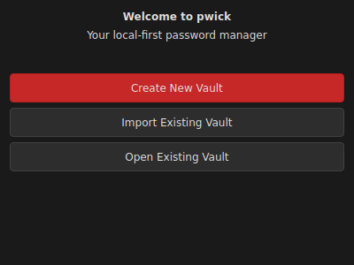
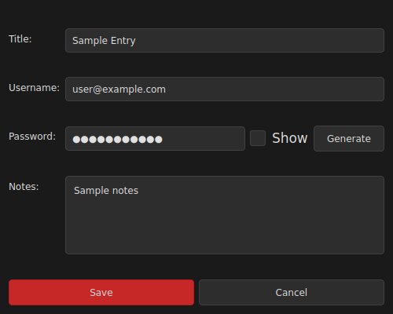

# pwick 🛡️
**Version 1.0.0** - _A simple, secure, and 100% local password manager._


pwick is a cross-platform password manager built for users who demand absolute privacy. Your data never leaves your computer, is never sent to a server, and is always protected by strong encryption.

## Philosophy

Your most sensitive information—your passwords—should remain completely under your control.

* **No Cloud:** Your vault is a single file on your local disk.
* **No Tracking:** No analytics, no tracking pixels, no network connections.
* **Total Privacy:** You are the only person who can access your data.

---

## Features

### Security
* **Encryption:** AES-256-GCM authenticated encryption with Argon2id key derivation
  - Time cost: 3 iterations, Memory cost: 64 MB, Parallelism: 1 thread
  - Unique 16-byte salt per vault
  - Prevents brute-force, dictionary, and rainbow table attacks
* **Master Password:** Never stored on disk, exists only in memory when unlocked
* **Encrypted Clipboard:** Passwords encrypted with AES-256-GCM before copying to system clipboard
  - Prevents OS telemetry and clipboard snooping
  - Session-unique encryption key
  - Auto-clears after 30 seconds
* **Import/Export:** Encrypted backup functionality for vault transfer

### Interface
* **Cross-Platform:** Windows and Linux native support
* **Dark Theme:** Black, grey, white, and red color scheme
* **System Tray:** Minimize to tray, run in background, double-click to restore
* **Keyboard Shortcuts:** 
  - Ctrl+C: Copy password | Ctrl+N: New entry | Ctrl+E: Edit entry
  - Delete: Delete entry | Ctrl+L: Lock vault | Ctrl+F: Find/focus
* **Clipboard History:** Panel showing last 30 copied items (refreshes daily)
* **Password Generator:** 20-character strong passwords with show/hide toggle
* **Entry Management:** Create, edit, delete entries with title, username, password, notes

---

## Screenshots




---

## Installation

### Quick Install

**Windows:**
```cmd
install.bat
```

**Linux/Mac:**
```bash
chmod +x install.sh
./install.sh
```

After installation, run from anywhere:
```bash
pwick
```

### Build From Source

```bash
# Clone repository
git clone https://github.com/orpheus497/pwick.git
cd pwick

# Automated build
chmod +x build.sh
./build.sh

# Manual build
python3 -m venv venv
source venv/bin/activate  # Windows: venv\Scripts\activate
pip install -r requirements.txt

# Run
python -m src.pwick
```

**Requirements:** Python 3.7+, PyQt5, cryptography, argon2-cffi, pyperclip (installed automatically)

---

## Uninstallation

**Windows:** `uninstall.bat`  
**Linux/Mac:** `./uninstall.sh`  
**Manual:** `pip uninstall pwick`

*Note: Vault files are NOT deleted for safety.*

---

## Usage

### First-Time Setup
1. Launch pwick
2. Choose "Create New Vault"
3. Set your Master Password

**⚠️ IMPORTANT:** Your Master Password cannot be recovered. If forgotten, your data is permanently inaccessible.

### Daily Use
* Unlock vault with Master Password
* Add, edit, copy, or delete password entries
* **Copy passwords:** Click "Copy Password" or press `Ctrl+C` (auto-clears after 30 seconds)
* **Clipboard History:** View last 30 copies, double-click to reuse (refreshes daily)
* **System Tray:** Close window to minimize to tray, double-click tray icon to restore
* **Keyboard Shortcuts:**
  - `Ctrl+C`: Copy password | `Ctrl+N`: New entry | `Ctrl+E`: Edit
  - `Delete`: Delete entry | `Ctrl+L`: Lock vault | `Ctrl+F`: Find
* Lock vault when idle

### Backup and Transfer
**Export:** File > Export Encrypted Vault → Save encrypted file  
**Import:** Choose "Import Existing Vault" → Select file → Enter Master Password

---

## Security

* **Encryption:** AES-256-GCM authenticated encryption
* **Key Derivation:** Argon2id (3 iterations, 64 MB memory, unique salt per vault)
* **Master Password:** Never stored on disk
* **Encrypted Clipboard:** Passwords encrypted before copying (prevents telemetry/snooping)
* **No Network:** Zero external connections, complete local-first architecture

---

## License

MIT License. See `LICENSE` file for details.
